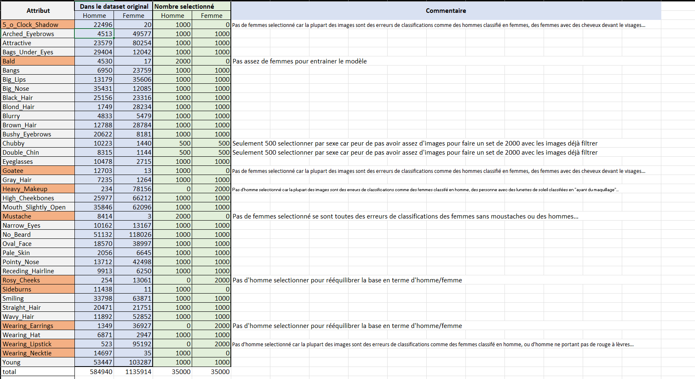
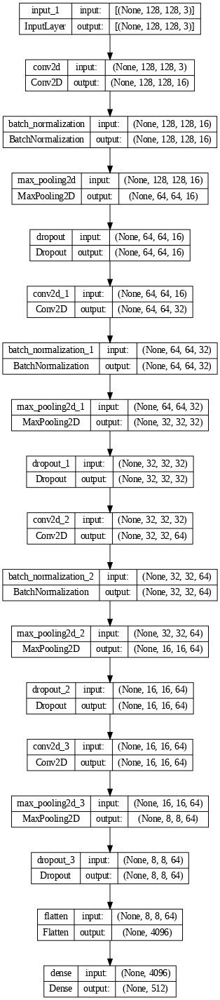
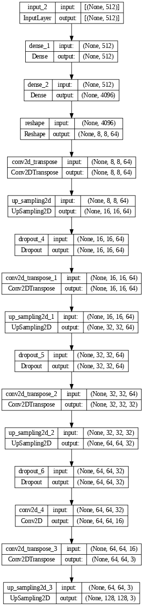
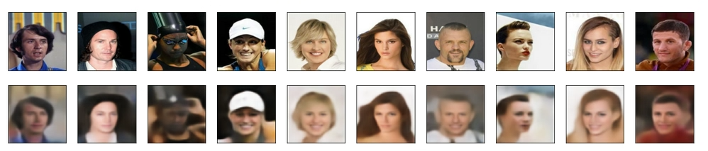
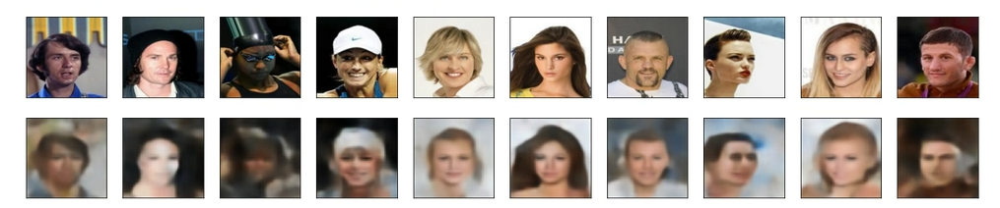
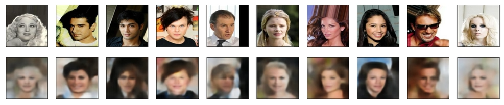
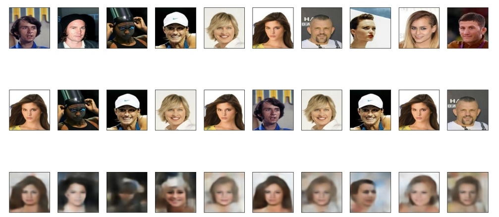

# ReadMe

---

# Portrait Robot

## Description

Ce logiciel a pour but de générer des portraits robots à partir de la base de données d’images de CelebA. Pour ce faire, le logiciel utilise un autoencodeur afin de réduire la taille des images et un algorithme génétique qui vient modifier les images de tailles réduites de l’autoencodeur.

## Technique

### Encodeur, Décodeur:

Le logiciel est fourni avec des modèles déjà entrainés. Il n’est donc pas nécessaire de créer un modèle pour l’exécution du logiciel. Tout le code utilisé pour la création et l’entrainement des modèles, ainsi que le code pour réduire et équilibrer la base de données d’images pour l’entrainement sont dans le fichier *Creation_encodeur_decodeur.pynb* 

- Principe Général :

La création de l'encodeur et du décodeur passe par la création d'un autoencodeur qui permet d'entraîner le réseau de neurones. L'autoencodeur est composé de la partie encodeur permettant de réduire la dimension de l'image en conservant au maximum l'information. Et le décodeur permettant à partir de l'image encodée de retrouvé au mieux l'image initiale. Le modèle a été entraîné sur 70000 images sélectionner de manière à représenter au mieux et de manière équilibrée les différentes caractéristiques.

- Création d’une base de données plus petites et plus équilibré :
    - Sélection des images
    
    La base de données d'images utiliser est CelebA  ([https://mmlab.ie.cuhk.edu.hk/projects/CelebA.html](https://mmlab.ie.cuhk.edu.hk/projects/CelebA.html) ).
    
    Cette base de données est déséquilibrée, en effet on trouve plus d'images caractérisées comme "femmes" que d'"hommes". Ceci peut entraîner le modèle à décoder de manière erronée les images. On a donc choisi de sélectionner 2000 (ou 1000 s'il y en avait trop peu) images par attributs avec à chaque fois 1000 (ou 500) images par sexe. Certains attributs n'ont quasiment pas de représentant pour un sexe et le peu de représentants sont souvent dus à des erreurs de classification, dans ce cas seulement les images du sexe représenté on été sélectionné. Ces choix ont été fait “à la main”. Après sélection des images représentant de manière équilibrée les deux sexes nous avons 70000 images sélectionnées avec 35000 femmes et 35000 hommes. Le détail du nombre sélectionné pour chaque attribut peut se retrouver ci-dessous.
    
    
    
    - Séparation en petit batch
    
    La sélection des attributs et combien d’images était sélectionnée par attributs a été faite à la main mais peut, peut-être, être automatisée dans une future version. Les fonctions ont été créées pour la base de données CelebA et son fichier d’attributs. Si une autre base de données est utilisée il faudra surement faire des modifications.
    
    Une fois les images sélectionnées, elles ont été mélanger et séparé en batch de 1000 images afin de faciliter l’entrainement de l’autoencodeur.
    
    - Amélioration possible:
    
    On pourrait d’abord essayer de “trier” la base de données en enlevant les visages de profils qui posent problème lors de l’entrainement et lorsqu’elles sont décoder. Cela pourrait se faire avec le fichier de la base de données CelebA qui donne les coordonnées du début et de la fin de l’œil afin d’essayer de trouver des valeurs abbérente qui pourrait correspondre à un visage de profil.
    
    Il serait aussi possible d’automatiser le choix du nombre d’images par attribut que l’on prend en fonction du nombre de représentant par sexe.
    
- Modèle de l’autoencodeur
    - Encodeur
    
    En partant d’une image en couleur de taille (128,128,3) on obtient un vecteur de taille (512).
    
    
    
    - Décodeur
    
    A partir d’un vecteur de taille (512 )on obtient un array numpy de (128,128,3)
    
    
    
    - Compilation :
    
    Lors de la compilation des modèles,  l’optimisateur “Adam” a été utilisé car il obtient de bon resultat assez rapidement.
    
- Entraînement :

Le modèle à été entrainé sur 70 fois avec des 1000 images différentes sur 100 epochs avec à chaque fois 800 images d’entrainement et 200 images de tests. 

- Resultat:
    
    
    
    
    

### Algorithme génétique

- principe général :

Le principe est de converger itérativement vers le visage de l’agresseur en créant une “population” de visage de manière aléatoire (le choix de la cliente était de guider la première population en choisissant quelques caractéristiques physique comme le sexe, la présence d’une barbe, la couleur des cheveux, …). On va ensuite selon le principe de l’algorithme génétique, calculer le coût de la population et sélectionné les individus avec le coût le plus faible, ici cette étape consiste à faire choisir à l’utilisateur les visages les plus ressemblants. On crée ensuite une nouvelle population à partir des visages choisis et de versions de ces derniers modifiées. Cependant, afin de s’assurer que l’utilisateur trouve des visages proches de celui visé malgré la petite population de seulement 6 visages, on ajoute à chaque itération 2 nouveaux visages aléatoires.

- A propos du choix de présenter des images random et des images ayant subi des modifications

les visages aléatoires vont donc faire en sorte d’élargir le choix de l’utilisateur tandis que les modifications vont permettre d’affiner ce choix.

- différentes techniques utilisées : mutations aléatoires sur les visages encodés,  crossing-over entre les visages choisis.

On notera que les 10 premières itérations contiennent des crossing-over, tandis que la suite ne contient que des mutations ponctuelles afin jouer sur des détails plus fins.

Le nombre d’images choisis est libre, on ne peut pas en choisir 0 ni 6 mais le reste est possible. Cependant si 4 ou 5 visages sont choisis cela affaiblis l’algorithme qui risque alors de tourner en rond  et ne laisse ni la possibilité de voir de nouveaux visages, ni d’affiner précisément (on ne connait alors, pas le visage le plus ressemblant). Avec l’aval de la cliente nous avons décidé de laisser la possibilité d’en choisir 4 ou 5 mais d’afficher un message informatif de dissuasion.

- limites :

Avec notre auto-encoder un grand nombre de mutation à répétition sur un visages dégrade la qualité de l’image

On peut également s’inquiéter du délai de convergence si l’utilisateur est indécis étant donné que de nouvelles images apparaissent à chaque itération.

- Résultat mutations:
    
    
    
    
    

- Résultats crossing over :
    
    
    

## Installation

1. Télécharger l'archive des fichiers sur github : [https://github.com/fmartin2001/Projet_logiciel.git](https://github.com/fmartin2001/Projet_logiciel.git) et les dézipper dans le dossier souhaité (éviter le dossier Téléchargement), ou bien exécuter `git clone [lien]` dans un terminal Linux là où vous voulez que le dossier soit placé.

2. Aller dans le dossier des fichiers et exécuter le fichier [installer.sh](http://installer.sh) en utilisant la commande : `./installer.sh` dans le terminal.

3. Un fichier d'application avec l'icône d'un robot doit être créé dans le dossier : il faut cliquer dessus pour lancer le programme.

4. Vous pouvez aussi exécuter le fichier lancer.sh pour lancer l'application en utilisant la commande : `./lancer.sh` dans le terminal.

## Documentation

Regarder les fichiers html du git.

## Autrices

Louise Ruyer, Natacha Doutreleau, Fannie Martin,  Clarisse Buton, Margaux Guégan

## License

Licence libre GPLv3